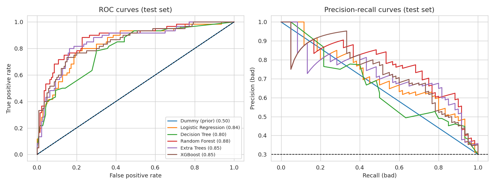
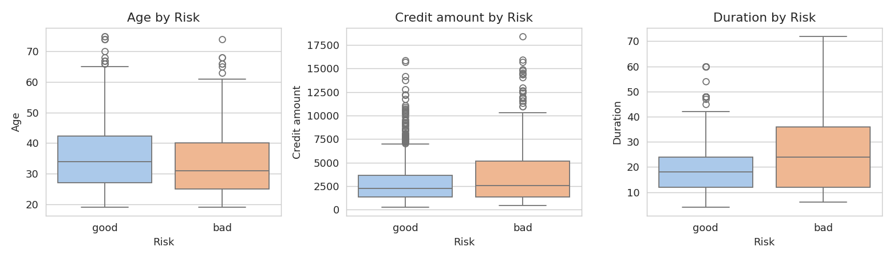
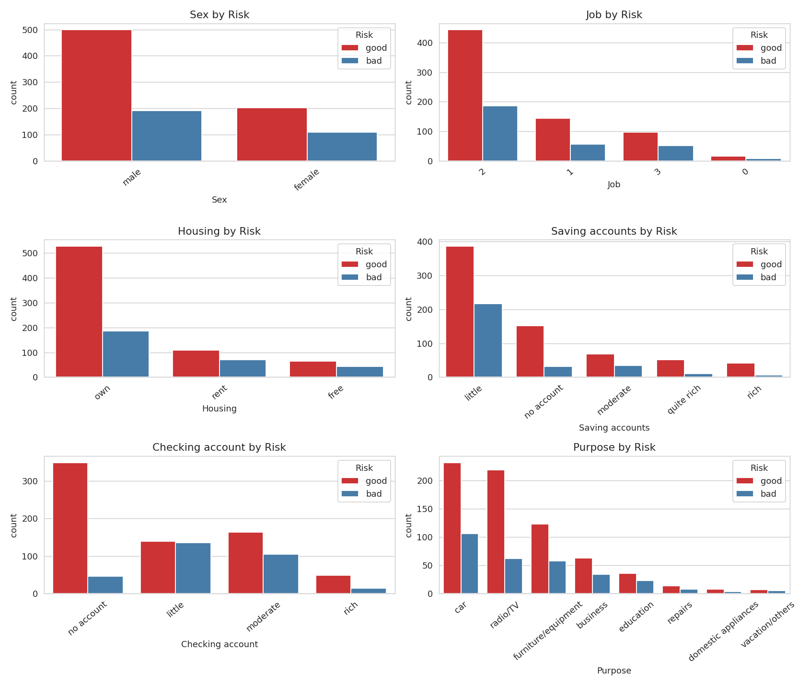
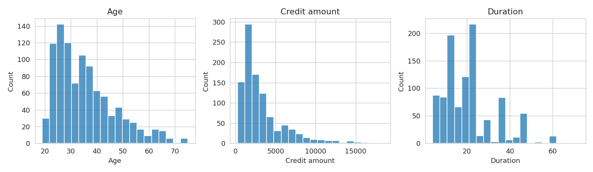
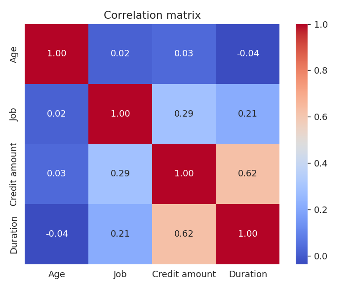
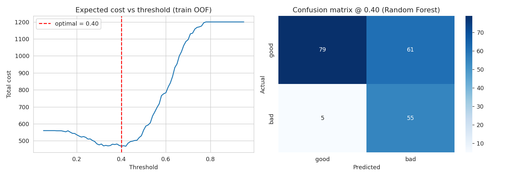
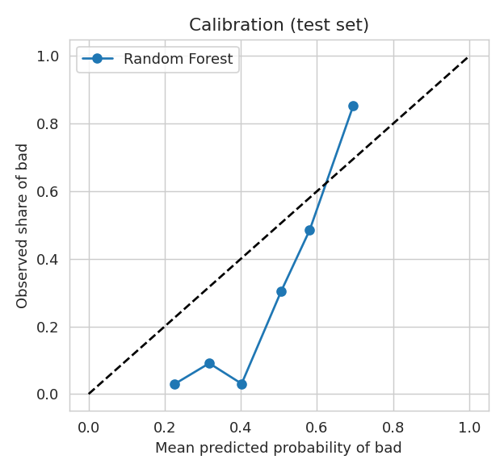
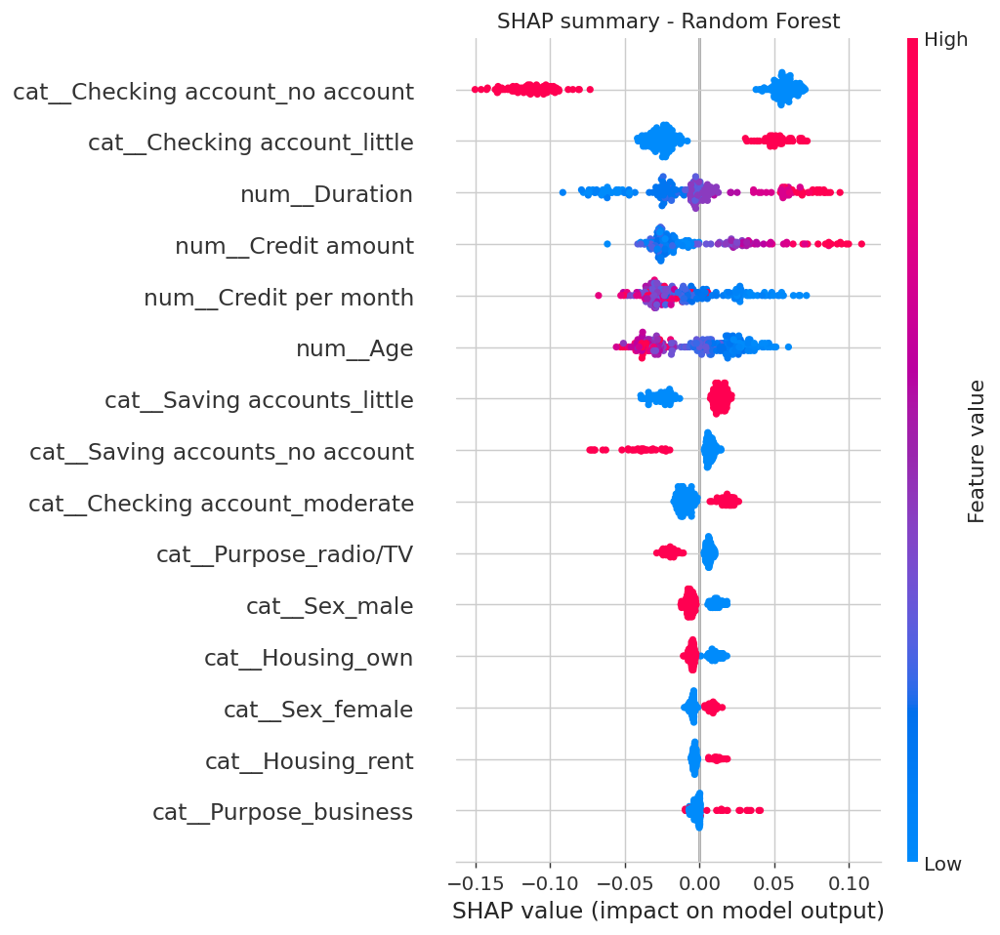
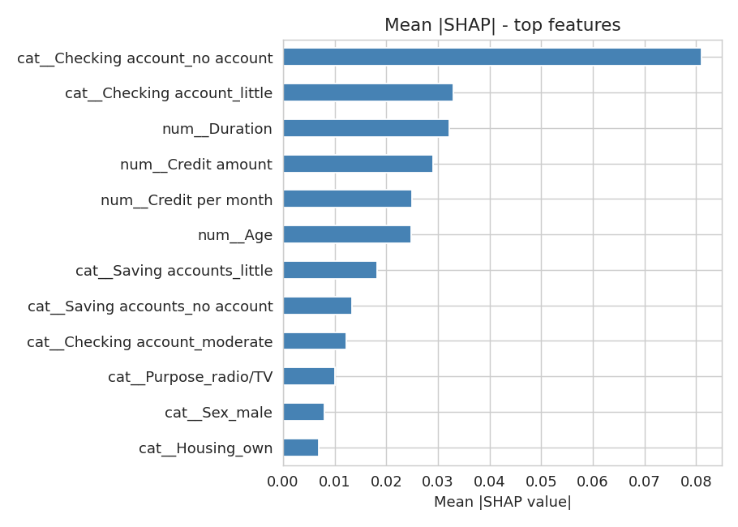
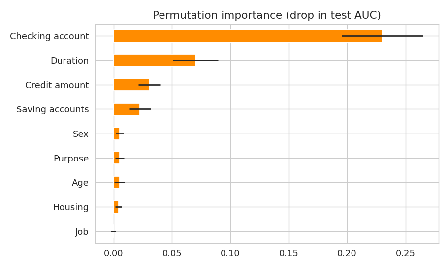

# Credit Risk Modelling Using Machine Learning

An end-to-end credit risk classifier built on the **German Credit (Statlog)** dataset. The project covers exploratory analysis, a leak-free preprocessing pipeline, benchmarked and tuned models, repeated cross-validation, a cost-sensitive decision threshold, SHAP explainability, and a Streamlit app that returns a risk probability with a per-applicant explanation.

**Target:** `Risk`, where `bad` = 1 is the positive class (30% of 1,000 applicants).

---

## Headline results

| Model | Test ROC-AUC | Repeated-CV AUC (5x3) | Recall (bad) @ 0.5 | Brier |
|---|---|---|---|---|
| **Random Forest (selected)** | **0.877** | **0.776 ± 0.031** | 0.883 | 0.171 |
| Extra Trees | 0.854 | 0.752 ± 0.033 | 0.883 | 0.182 |
| XGBoost | 0.846 | 0.762 ± 0.029 | 0.783 | 0.169 |
| Logistic Regression | 0.837 | 0.754 ± 0.032 | 0.833 | 0.184 |
| Decision Tree | 0.795 | 0.706 ± 0.026 | 0.817 | 0.189 |
| Dummy baseline | 0.500 | 0.500 | 0.000 | 0.210 |

- **Use the repeated-CV AUC (about 0.78) as the headline figure.** The 0.877 test AUC comes from a single 200-row split with only 60 bad cases, so it is optimistic. Repeated stratified 5-fold CV (3 repeats) on all 1,000 rows is the more reliable estimate.
- The Random Forest ranks first on both measures, but its lead over XGBoost and Logistic Regression is within about one standard deviation. Treat the ranking as indicative, not definitive.
- At the default 0.5 cut-off the model catches **88% of bad applicants** (precision 59%; 7 of 60 bad applicants approved).
- Selected hyperparameters: `n_estimators=300`, `max_depth=5`, `min_samples_leaf=3`, `class_weight='balanced'`.



---

## Project workflow

1. **Load and clean:** keep all 1,000 rows. `NA` in the savings and checking columns means *no account* and is kept as its own category.
2. **EDA:** distributions, risk by segment, correlations.
3. **Pipeline:** feature engineering, one-hot encoding and scaling all run inside an sklearn `Pipeline`, so they are fitted on training folds only. The same code runs in the app (`credit_utils.py`).
4. **Models:** dummy baseline, Logistic Regression, Decision Tree, Random Forest, Extra Trees, XGBoost, tuned with 5-fold `GridSearchCV` on ROC-AUC. Class imbalance is handled with class weights.
5. **Evaluation:** ROC-AUC, PR-AUC, recall and precision on *bad*, Brier score, repeated cross-validation, calibration.
6. **Cost-sensitive threshold:** decision cut-off chosen with the 5:1 Statlog cost matrix.
7. **Explainability:** SHAP and permutation importance.
8. **Deployment:** a single exported pipeline and a Streamlit app.

---

## Exploratory data analysis

Bad applicants tend to take **larger and longer** loans: the average credit amount is 3,938 DM for bad vs 2,986 DM for good, and the average duration is 24.9 vs 19.2 months. Applicants with a *little* checking balance have the highest bad rate (49%).





<details>
<summary>More EDA plots</summary>





</details>

---

## Cost-sensitive decision threshold

The Statlog documentation states that approving a bad applicant (false negative) costs **5x** as much as rejecting a good one (false positive). The threshold was chosen by minimising that cost on **out-of-fold training predictions only**, which gave **0.40**, and then applied once to the held-out test set.

| Threshold | Recall (bad) | Precision (bad) | Bad approved (FN) | Good rejected (FP) | Total cost |
|---|---|---|---|---|---|
| Default 0.50 | 0.883 | 0.589 | 7 | 37 | 72 |
| Cost-optimal 0.40 | 0.917 | 0.474 | 5 | 61 | 86 |

On the test set the 0.40 cut-off caught more bad applicants but rejected many more good ones, so total cost was slightly *higher* than at 0.50. With only 60 bad cases that difference is within noise. The 0.40 threshold is kept in the app because it was selected on training data without using the test set, and the trade-off is reported openly.



---

## Calibration

The model ranks applicants well, but its raw scores are **not calibrated probabilities**. Class weighting pushes predictions upward, so low-risk applicants are over-estimated and the highest-risk bucket is under-estimated. Read the app's percentage as a risk *score*. Probability calibration (isotonic or Platt scaling) would be the next improvement.



---

## Explainability

**SHAP** shows which features push an applicant towards bad or good risk. Checking-account status is the strongest driver, followed by loan duration, credit amount and savings-account status. Longer and larger loans raise risk.





**Permutation importance** on the test set (drop in AUC) agrees on the top features: checking account (about 0.23), duration (0.07), credit amount (0.03) and savings account (0.02), while age, sex, housing and job contribute little.



> Applicants with **no checking account** are modelled as *lower* risk. This is a known characteristic of this dataset (that group has the lowest default rate) and is not a causal statement.

---

## What changed from the first version

| Before | Now |
|---|---|
| Dropped every row with a missing account (478 of 1,000) | Kept all rows; `NA` = "no account" |
| Accuracy-only model selection | ROC-AUC, PR-AUC, recall/precision on *bad*, Brier, repeated CV |
| No baselines | Dummy and Logistic Regression baselines |
| Label-encoded categoricals | One-hot encoding inside an sklearn `Pipeline` (no leakage) |
| Default 0.5 cut-off | Cost-based threshold using the 5:1 cost matrix |
| No explainability | SHAP (global and per applicant) and permutation importance |
| Several pickles plus duplicated encoding in the app | One `credit_risk_model.joblib` and a shared `credit_utils.py` |
| Raw features only | Added `Credit per month` (a repayment-burden proxy) |

---

## Streamlit app

`app.py` loads the exported pipeline and returns the estimated probability of bad risk, a LOW or HIGH risk decision at the cost-based threshold, and a bar chart of the top drivers for that applicant.

```bash
streamlit run app.py
```

---

## Project structure

```
.
├── credit_risk_modeling.ipynb     # Full analysis (executed, with outputs)
├── credit_utils.py                # Shared features + preprocessing (notebook and app)
├── app.py                         # Streamlit app
├── german_credit_data.csv         # Dataset including the Risk target
├── credit_risk_model.joblib       # Trained pipeline + threshold (generated by the notebook)
├── metrics_summary.json           # Headline metrics
├── model_comparison_test.csv      # Test-set comparison
├── model_comparison_repeated_cv.csv
├── figures/                       # EDA, ROC/PR, threshold, calibration, SHAP plots
└── requirements.txt
```

## Run it

```bash
pip install -r requirements.txt
jupyter nbconvert --to notebook --execute --inplace credit_risk_modeling.ipynb   # optional: retrain
streamlit run app.py
```

## Data

German Credit (Statlog) data, Hofmann (1994), UCI Machine Learning Repository, in the readable Kaggle version with columns `Age, Sex, Job, Housing, Saving accounts, Checking account, Credit amount, Duration, Purpose, Risk`. 1,000 applicants: 700 good, 300 bad.

## Limitations

- Small and old (1994) dataset, so results will not transfer directly to a modern portfolio.
- The 200-row test split is noisy; cross-validation standard deviation is about 0.03 AUC.
- Raw model scores are not calibrated probabilities (see Calibration).
- `Sex` and `Age` are used as features for demonstration only. In real lending they raise fairness and regulatory concerns and would be reviewed or excluded.
- No out-of-time validation, because the data has no dates.
- Educational project. Not for real credit decisions.
